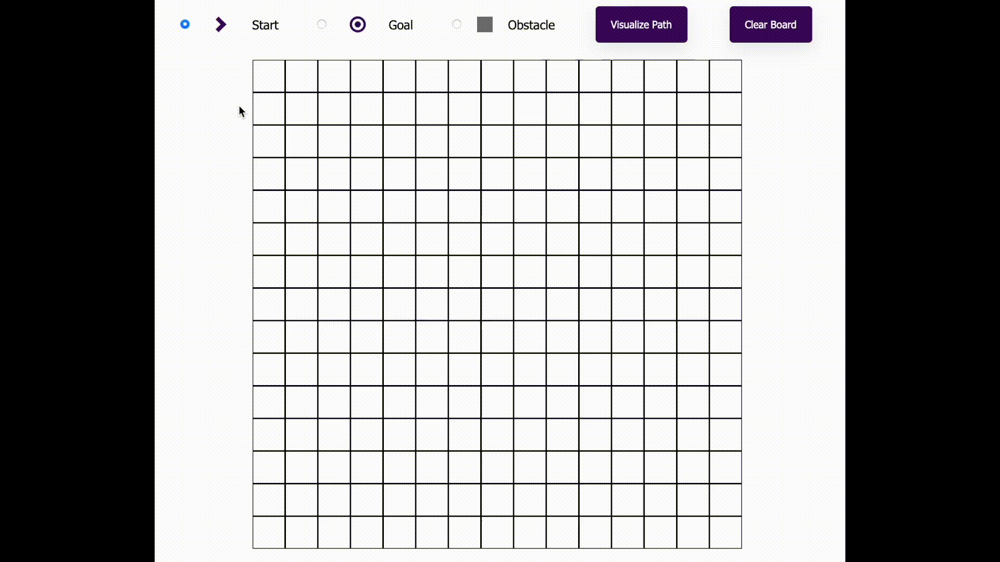

# 🧭 Pathfinding Visualizer

An interactive tool for visualizing the **Breadth-First Search (BFS)** algorithm. This project helps you learn and understand how a path is found from a starting point to a destination in a grid — while navigating around obstacles.

---

## ✨ Features

- 🎯 Select a **start** and **end point**
- 🧱 Place **obstacles (walls)** in the grid
- 🔍 Visualize the **BFS algorithm** in real-time
- 🔁 Reset and re-run the search anytime
- 💡 Great for learning and teaching graph traversal algorithms

---

## 🧠 Algorithm Used

The **Breadth-First Search (BFS)** is an unweighted graph search algorithm that guarantees the shortest path (if one exists). It explores all neighboring nodes level by level, ensuring the most efficient path through the grid.

---

## 🖥️ Demo

> 📺 **Try the Live Demo:** [Click here](https://pathfinding-visualizer-esjj.onrender.com)  
> 

---

## 🛠️ Installation

1. 🔽 Clone the repository

```bash
git clone https://github.com/your-username/pathfinding-visualizer.git
cd pathfinding-visualizer
